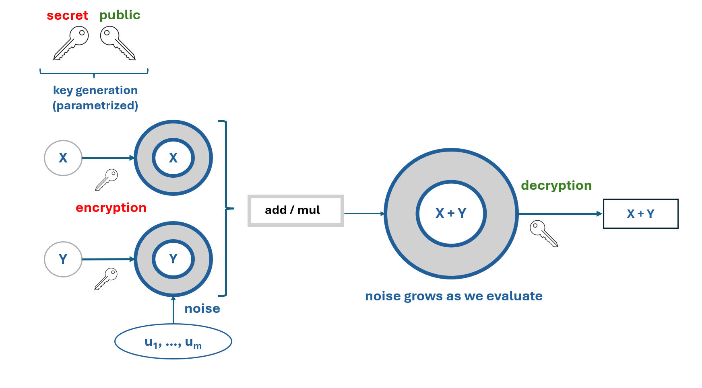

# Post Quantum Cryptography - HPPK

    

Welcome to the repository for the implementation of **Homomorphic Polynomial Public Key Cryptography (HPPK)**. This project serves as a review of the asymmetric cryptographic method introduced by Randy Kuang et al. (2024). The goal is to understand its algebraic foundations, its relationship with finite fields, and its potential as a post-quantum cryptographic solution. Additionally, we analyze its efficiency and security constraints.

---

## Introduction

**Diffie-Hellman key exchange** and **RSA cryptosystem** public key cryptography methods are challenged by the rise of quantum computing. In this domain, **post-quantum cryptography (PQC)** and HPPK provide a more complex yet efficient mechanism for asymmetric encryption.

### Comparison of Cryptographic Methods

1. **Advanced Encryption Standard (AES):**
   - Operates in the finite field GF(2^8).
   - Highly efficient with low memory requirements.
   - Primarily used for symmetric encryption.

2. **Rivest-Shamir-Adleman (RSA):**
   - Relies on modular exponentiation in the ring Z/nZ.
   - More complex than AES with higher memory requirements.
   - Widely used for public-key encryption.

3. **Polynomial Public Key Cryptography (PPKC):**
   - Represents keys and messages as polynomials over finite fields Fp (where p is prime).
   - Balances secure key exchange and encryption/decryption.
   - Efficiency depends on polynomial sizes, potentially slower than RSA.

---

## Methodology

**Homomorphic Polynomial Public Key (HPPK)** extends PPKC by incorporating homomorphic properties. It supports both addition and multiplication operations, making it partially homomorphic. 

Like RSA, HPPK uses separate public and private keys. However, its public key is derived from polynomial multiplications over finite fields, offering a unique approach to encryption. HPPK is particularly suited for **Key Encapsulation Mechanisms (KEM)**, which involve:

1. **Key Pair Generation:** Creating public and private keys.
2. **Encapsulation:** Encrypting to generate a shared secret key.
3. **Decapsulation:** Decrypting to recover the shared key.

---

## Analysis

HPPK has been evaluated for its security and efficiency:

- **Security:** 
  - A private key recovery attack has complexity O(2p(S1 + S2)).
  - A forgery attack has complexity O(S1 ∗ S2).
  - Despite these challenges, HPPK demonstrates strong security properties for digital signatures.

- **Efficiency:**
  - The **Barrett-reduction algorithm** reduces overhead in decapsulation and polynomial modular multiplication.
  - HPPK outperforms other cryptographic schemes, including AES-based systems like Kyber, in key generation and encryption efficiency.

### Performance Benchmark

The table below compares HPPK's performance with NIST-standardized Kyber and round 4 candidates McEliece, BIKE, and HQC. Performance data for BIKE and HQC are cited from their NIST submission specifications, while data for McEliece and Kyber are computed using the same SUPERCOP tool as HPPK KEM schemes. 

**Note: ** 
Kyber is a **lattice-based cryptographic algorithm** that relies on the **Learning With Errors (LWE)** problem, a hard problem in lattice theory. It is designed for **Key Encapsulation Mechanisms (KEM)** and is known for its efficiency, small key sizes, and strong security guarantees. Kyber was selected by NIST as the primary standardized KEM for post-quantum cryptography.

**BIKE (Bit Flipping Key Encapsulation)**
BIKE is a **code-based cryptographic algorithm** that leverages the hardness of decoding random linear codes. It is optimized for performance using **AVX2 instructions**, which enhance its efficiency on modern processors. BIKE is a round 4 candidate in the NIST PQC standardization process and is particularly suited for environments requiring lightweight cryptographic solutions.

**HQC (Hamming Quasi-Cyclic)**
HQC is another **code-based cryptographic algorithm** that builds on the difficulty of decoding random linear codes. It is designed for KEM and offers a balance between security and performance. HQC is also a round 4 candidate in the NIST PQC process and is recognized for its robustness against quantum attacks.

**McEliece**
McEliece is a **code-based cryptographic algorithm** that has been a cornerstone of post-quantum cryptography since its introduction in 1978. It relies on the hardness of decoding random linear codes and is known for its exceptional security. However, it has large key sizes compared to other schemes. McEliece is a round 4 candidate in the NIST PQC process and remains a strong contender for post-quantum security.

| System               | KeyGen       | Encapsulation | Decapsulation |
|----------------------|--------------|---------------|---------------|
| **Security Level I** |              |               |               |
| McEliece             | 152,424,455  | 108,741       | 45,122,734    |
| Kyber                | 72,403       | 95,466        | 117,406       |
| BIKE (AVX2)          | 589,000      | 97,000        | 1,135,000     |
| HQC                  | 187,000      | 419,000       | 833,000       |
| HPPK-(32,1,1,2)      | 12,665       | 25,963        | 63,365        |
| HPPK-(32,1,1,3)      | 20,098       | 65,776        | 63,729        |

## References

For further details please refer to the following paper:

- Kuang, R., Perepechaenko, M., Lou, D., & Tank, B. (2024). *Benchmark Performance of Homomorphic Polynomial Public Key Cryptography for Key Encapsulation and Digital Signature Schemes*. Retrieved from [https://eprint.iacr.org/2024/019](https://eprint.iacr.org/2024/019)
